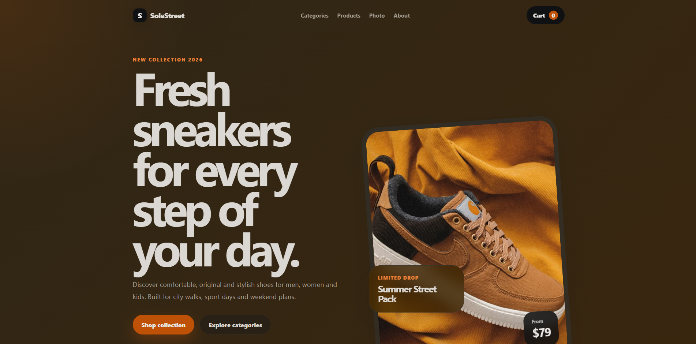
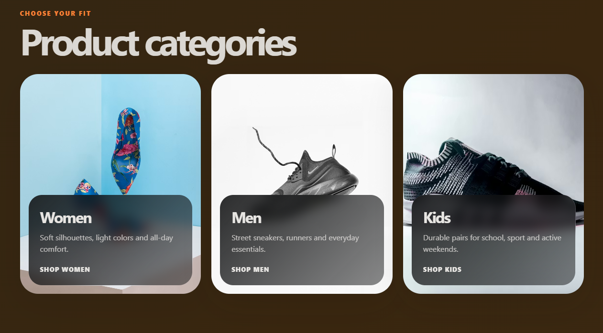
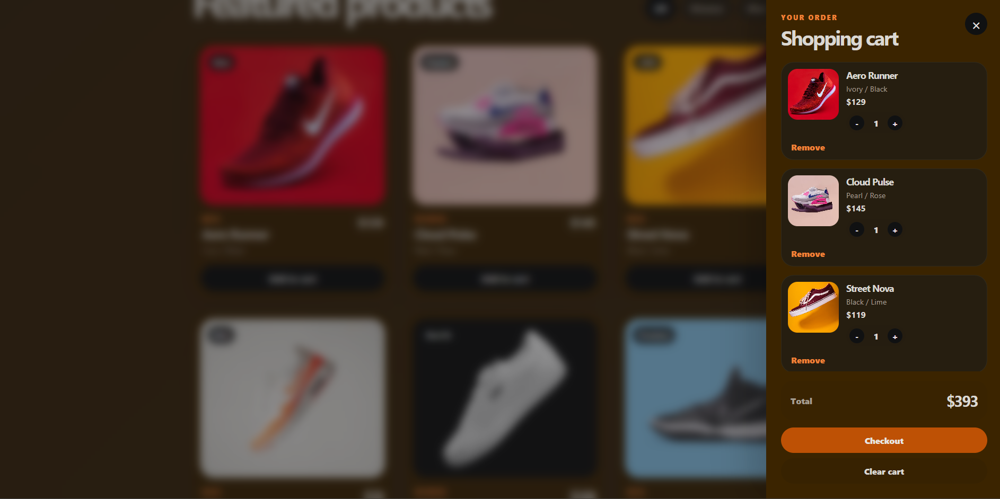

# Sneaker Store

A modern responsive sneaker store built with React and Vite.

The project allows users to browse sneaker products, filter them by category, add products to the shopping cart, change quantities, remove items and calculate the total cart price.

## Live Demo

Coming soon

## Features

* Modern responsive landing page
* Product catalog
* Category filtering: All / Women / Men / Kids
* Shopping cart
* Add products to cart
* Increase and decrease product quantity
* Remove products from cart
* Clear cart
* Cart total price calculation
* Component-based React structure
* Clean CSS styling

## Tech Stack

* React
* Vite
* JavaScript
* CSS
* ESLint

## Getting Started

Clone the repository:

```bash
git clone https://github.com/localxxv/Sneaker-Store.git
```

Go to the project folder:

```bash
cd Sneaker-Store
```

Install dependencies:

```bash
npm install
```

Run the project:

```bash
npm run dev
```

Build the project:

```bash
npm run build
```

## Project Structure

```text
src/
├── assets/
├── components/
│   ├── AboutSection.jsx
│   ├── Cart.jsx
│   ├── CategoriesSection.jsx
│   ├── CategoryCard.jsx
│   ├── Footer.jsx
│   ├── GallerySection.jsx
│   ├── Hero.jsx
│   ├── HeroVisual.jsx
│   ├── Logo.jsx
│   ├── Navbar.jsx
│   ├── ProductCard.jsx
│   ├── ProductFilters.jsx
│   ├── ProductsSection.jsx
│   └── SectionHeading.jsx
├── data/
│   └── storeData.js
├── App.jsx
├── App.css
├── index.css
└── main.jsx
```

## Screenshots







## What I Learned

During this project I practiced:

* Building a React application with reusable components
* Working with component props and state
* Filtering product data
* Creating shopping cart logic
* Updating item quantities
* Structuring a frontend project for a portfolio

## Future Improvements

* Save cart items in localStorage
* Add product search
* Add product sorting by price
* Add product details page
* Add wishlist / favorites
* Add checkout page
* Add tests
